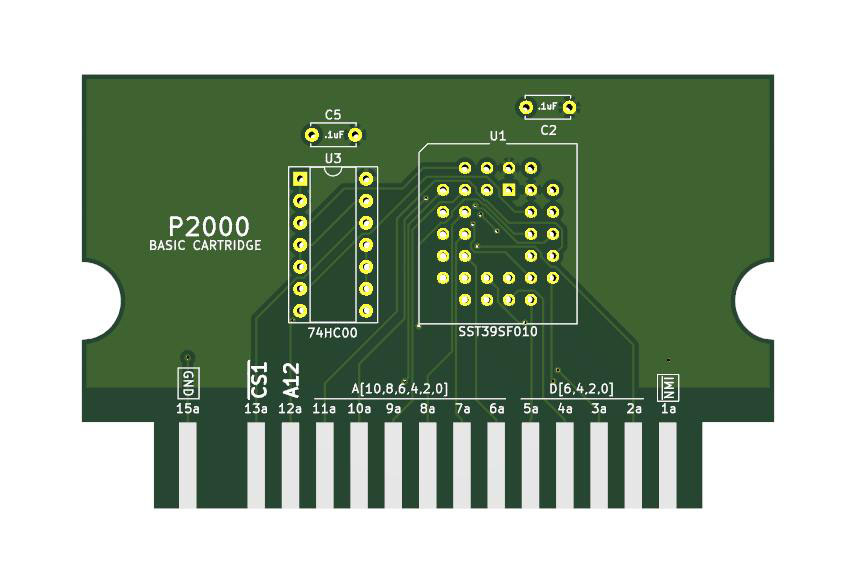

# P2000T Simple Cartridge

## Purpose

This repository contains a simple example on how to build your own cartridge
for the P2000T.

For more information, see [this blog post](https://www.philips-p2000t.nl/cartridges/basic-cartridge).

## Contents

* [KiCad source files](pcb/basic_cartridge) for the PCB.
* [STL files]((case)) for a cartridge enclosure.
* [Simple Hello World program](assembly/hello_world/hello_world.asm) source code for the ROM.

## Cartridge BOM

* [74HC00 Quad NAND gate](https://www.reichelt.nl/nl/nl/4-voudige-2-input-nand-poorten-2--6-v-dil-14-74hc-00-p3119.html?r=1)
* [SST39SF010 rom chip](https://www.reichelt.nl/nl/nl/multi-nor-flash-geheugen-1-mb-128-k-x-8-5-v-plcc-32-39sf01070-4c-n-p266390.html?r=1)
* [PLCC32 IC-socket](https://www.reichelt.nl/nl/nl/ic-fitting-32-polig-plcc-plcc-32-p14700.html?r=1)
* 2x 0.1 uF capacitor